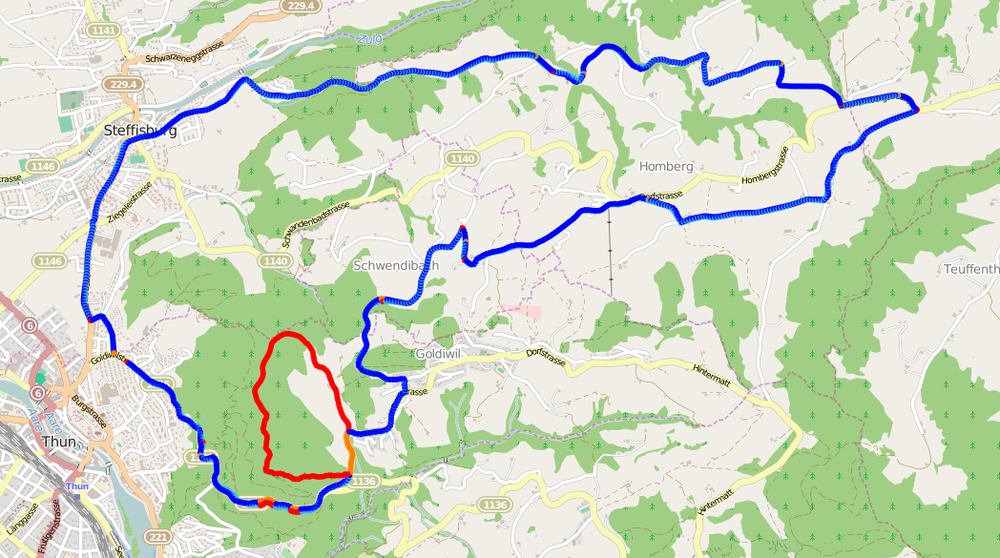

compare_gpx is a python3 script that uses the [Needleman-Wunsch][1] algorithm
to align GPS tracks in GPX files so they can be compared.

# Installation

Running the following commands should be enough to setup a virtual environment
to run the script:

    python3 -m venv --without-pip venv
    source venv/bin/activate
    curl https://bootstrap.pypa.io/get-pip.py | python
    deactivate
    source venv/bin/activate
    pip install -r requirements

# Information

More information about the implementation can be found on my blog in the posts:

* [How to compare GPS tracks][2]
* [How to distribute GPS points evenly][3]

# Tests

The tests can be run with the following command:

    venv/bin/nosetests

# Scripts

* `cmpgpx.py` performs and plots the alignment
* `dist.py` performs and plots only the distribution of points

# Example

The image below is an example of a comparison between
[thun_1_even.gpx](examples/thun_1_even.gpx) and
[thun_2_even.gpx](examples/thun_2_even.gpx) with the
distance cutoff set to 10. The blue points indicate matches, whereas the red
and orange indicate differences.

This was created with the following command:

    cmpgpx.py -e 20 examples/thun_1_raw.gpx examples/thun_2_raw.gpx

# License

This is free and unencumbered software released into the public domain. See
UNLICENSE for more information.

[1]: https://en.wikipedia.org/wiki/Needleman-Wunsch_algorithm
[2]: http://humblecoder.com/how-to-compare-gps-tracks
[3]: http://humblecoder.com/how-to-distribute-gps-points-evenly
